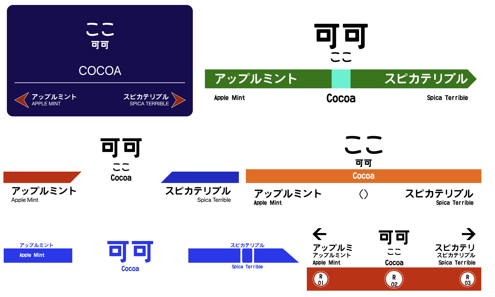
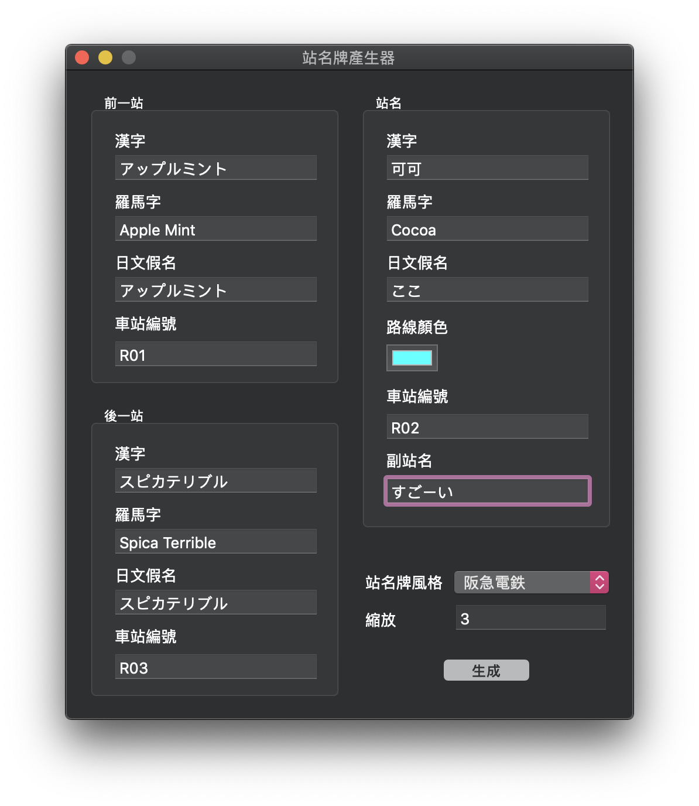

# eki
站名牌產生器

[站名牌產生器]()

### Usage

Compile, run, fill in the blanks and generate!

### How to add new design?

Well, you may design the new one(s) in PaintCode and it can generate SVG and Cocoa code for you!

To add new design(s), you may refer to `Ekimeow.m`, `Ekimeow.h` and `ViewController.m`

There should be a better design pattern for the code, but I'm too lazy and too busy to rewrite this. So any PR is welcome:)
